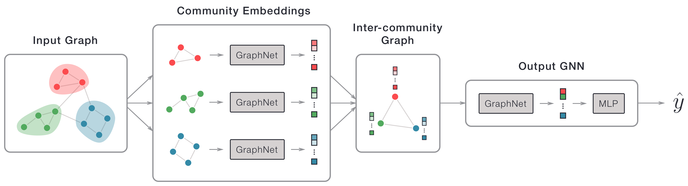

# CommunityNet

`CommunityNet` is a hierarchical Graph Neural Network (GNN) designed for graph datasets with community structure (e.g. social networks, molecules, etc.).<!--TODO: It outperforms a standard GNN on some benchmark datasets yadda yadda-->



## Installation

You can download `CommunityNet` from PyPi:

```bash
$ pip install communitynet
```

## Usage

Each graph you submit to `CommunityNet` must be an instance of `torch_geometric.data.Data` with an additional `communities` attribute. `data.communities` should hold a list of communities, where each community is a set of node indices. Every graph in your dataset must have the same number of communities.

Before instantiating `CommunityNet`, you must define a "base" GNN and an "output" GNN. The _base GNN_ is used to create vector embeddings of each community in an input graph. These embeddings are used as node features in an "inter-community" graph, where each node represents a community and each edge is the mean of the edges between two communities. This graph is submitted to the _output GNN_ to make a prediction. Both GNNs can be constructed using the `GraphNet` and `MLP` PyTorch modules supplied by the library. For example, to construct the `CommunityNet` shown in the diagram above, you can do the following:

```python
from communitynet import GraphNet, MLP, CommunityNet

# Example numbers (arbitrary)
num_node_features = 4
num_edge_features = 2

base_gnn = GraphNet(in_channels=num_node_features, out_channels=8,
                    num_edge_features=num_edge_features)
output_gnn = nn.Sequential(
  GraphNet(in_channels=8, out_channels=4, num_edge_features=num_edge_features),
  MLP(in_channels=4, out_channels=1)
)
community_net = CommunityNet(base_gnn, output_gnn, num_communities=3)
```

`GraphNet` and `MLP` both have additional hyperparameters (e.g. hidden layers, dropout, etc.) which are described in the reference below. The `CommunityNet` class itself derives from `torch.nn.Module`, so it can be trained like any other PyTorch model.

<!--TODO: Example Data object being submitted to community_net-->

## Reference

### GraphNet

PyTorch module that implements a GNN. Uses `NNConv` (an edge-conditioned convolutional operator) as a filter and global pooling to convert a graph into a vector embedding.

**Parameters:**

1. **`in_channels` _(int)_:** TODO
2. **`out_channels` _(int)_:** TODO
3. **`num_edge_features` _(int)_:** TODO
4. **`hidden_channels` _(list, optional (default=[]))_:** TODO
5. **`use_pooling` _(bool, optional (default=False))_:** TODO
6. **`dropout_prob` _(float, optional (default=0.0))_:** TODO
7. **`global_pooling` _(str, optional (default="mean"))_:** TODO
8. **`activation` _(torch.nn.Module, optional (default=None))_:** TODO
9. **`edge_nn_kwargs` _(dict, optional (default={}))_:** TODO

### MLP

PyTorch module that implements a multi-layer perceptron. This can be used in an output GNN to convert a graph embedding into a prediction (e.g. a classification/regression).

**Parameters:**

1. **`in_channels` _(int)_:** TODO
2. **`out_channels` _(int)_:** TODO
3. **`hidden_channels` _(list, optional (default=[]))_:** TODO
4. **`h_activation` _(torch.nn.Module, optional (default=None))_:** TODO
5. **`out_activation` _(torch.nn.Module, optional (default=None))_:** TODO

### CommunityNet

PyTorch module that implements a hierarchical GNN.

**Parameters:**

1. **`base_gnn` _(torch.nn.Module)_:** TODO
2. **`output_gnn` _(torch.nn.Module)_:** TODO
3. **`num_communities` _(int)_:** TODO
4. **`num_jobs` _(int, optional (default=-1))_:** TODO

<!--
Helpers for creating datasets (if each graph has same # of nodes, diff # of nodes, etc.)
-->
